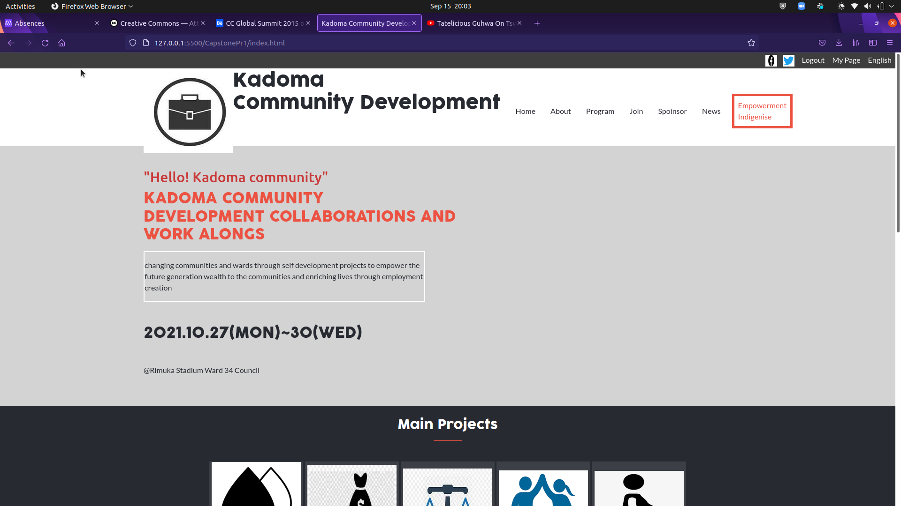

# Capstone Project 

# Community Development 

>This website if a community development website dedicated for my local city

>
## Built With

- HTML5
- CSS3
- Bootstrap

## Live presentation

- https://www.loom.com/share/8feee13007f2414182ba4ef53aee9173

### Usage

 - to get a local copy up and running follow these simple example steps.

- Open terminal

- Clone this project by the command `git clone https://github.com/mutinhiri/CapstonePr1`

- `Cd feature` folder

- Open `index.html` in your local browser or using Live Server in Visual Studio Code.

# Live Demo

[Community development] (https://mutinhiri.github.io/Capstonepr1)

## Authors

👤 **Bunbee**

- GitHub: [@mutinhiri](https://github.com/mutinhiri)
- Twitter: [@Bunbee2271](https://twitter.com/@Bunbee2271)
- LinkedIn: [barnabas mutinhiri](https://linkedin.com/in/bunbee)

## 🤝 Contributing

Contributions, issues, and feature requests are welcome!

## Show your support

Give a ⭐️ if you like this project!

## Acknowledgments
[Cindy-Shin] (https://www.behance.net/gallery/29845175/CC-Global-Summit-2015)
- Thanks to Microverse community

## 📝 License

This project is [MIT](./MIT.md) licensed.